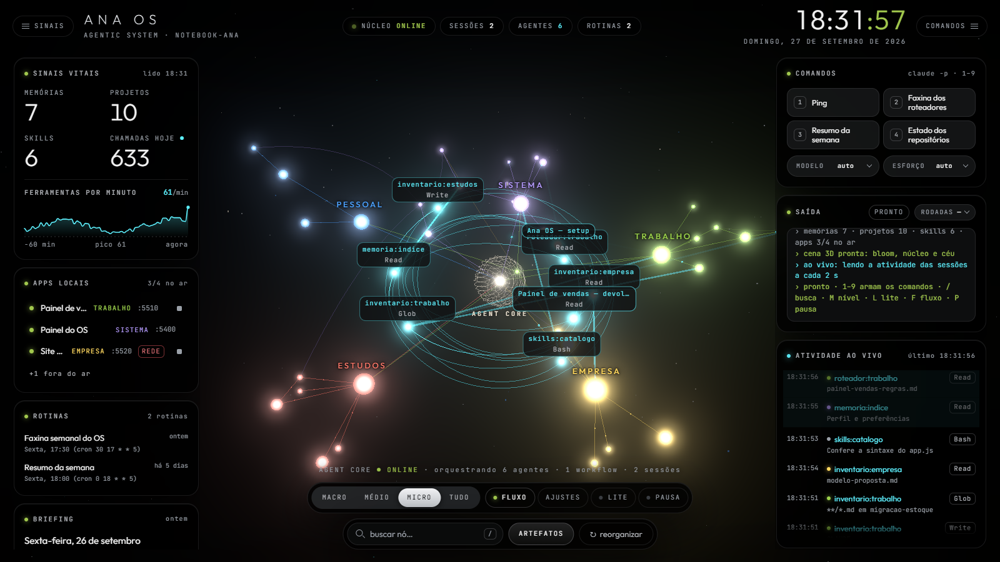

# Nexaya OS — Agentic System for Claude Code

A Claude Code plugin that builds **your own** agentic operating system on your
machine, under the name you choose: departments with markdown routers,
per-department memory, handoffs between sessions, registries of local apps,
and scheduled routines.



*Versão em português abaixo: [Português](#português).*

## What it is

Claude Code starts every session without knowing where your things are.
Nexaya OS fixes that with files: a root `CLAUDE.md` (the hub) points to one
router per department, and each router points to projects, memories, skills,
apps, and routines. A session reads the hub, the task's router, and the
project's `PROXIMO.md`, and only then opens detail files.

Nothing of yours moves. The OS is a thin markdown layer that says where things
already are; deleting it breaks nothing. The setup assistant interviews you
and builds your OS, with your own areas and the name you give it.

## Nexaya OS and Nexaya OS Pro

Nexaya OS is open core: the core is free and complete; the live panel is a
paid add-on installed on top of it.

| | Nexaya OS (free) | Nexaya OS Pro (coming soon) |
|---|---|---|
| Setup assistant, with the OS name you choose | Yes | Yes (uses the core) |
| Hub, routers, and per-department memory | Yes | Yes |
| `handoff` and `faxina-os` skills | Yes | Yes |
| `apps.json` and `rotinas.json` registries, scheduled routines | Yes | Yes |
| Live 3D panel: OS graph, Claude activity, galaxy adjustments | — | Yes |
| `claude -p` job deck and local app control, behind safety locks | — | Yes |
| Panel on your phone, only inside your own Tailscale network | — | Yes |
| Panel installer | — | Yes |
| License | MIT | Commercial |
| Where | This repository | Nexaya Design System Supporter tier ([ds.nexaya.com.br](https://ds.nexaya.com.br)), US$ 4.99 one-time — coming soon |

The Pro is not for sale yet: it arrives with the Supporter tier of the Nexaya
Design System, when the DS goes live. Until then, everything in the free
column works without it. The screenshot above is the Pro's live panel.

## What the free core includes (ARMS)

- **Skills:** `nexaya-os` (setup: interview, the OS name, read-only
  inventory, writing the OS, review; also extends or renames an existing OS),
  `handoff` (a dated handoff, the project's `PROXIMO.md`, and a continuation
  prompt at the end of a session), `faxina-os` (weekly read-only check:
  broken router links, memories missing from the index, stale `PROXIMO.md`,
  loose files, registry problems; writes a report and fixes nothing).
- **Memory:** a hub plus one `CLAUDE.md` router per department in a fixed
  format (defined in your OS's `CONVENCOES.md`), one `MEMORIA.md` per
  department, and `MEMORY.md` grouped by department.
- **Routines:** a single `rotinas.json` registry of scheduled tasks that write
  a file and stop (sending, publishing, or touching a repo stays with you),
  created only after your yes.
- **Applications:** a single `apps.json` registry with the folder, command,
  port, and machine of each local server, so Claude looks ports up instead of
  guessing.

Two sizes: **memory and skills**, or **full ARMS** (plus the apps and routines
registries). The Pro panel is offered at the end, in either size.

## Install

From the Claude Code terminal:

```
/plugin marketplace add baconshow/nexaya-os
/plugin install nexaya-os@nexaya
```

Then open a new session and run `/nexaya-os` (listed as
`/nexaya-os:nexaya-os`, since plugin skills carry the plugin prefix), or just
ask Claude to set up your OS with Nexaya OS.

From the Claude app: **Settings → Plugins → Add → "Add from a repository"**,
then type `baconshow/nexaya-os` and install `nexaya-os` from the `nexaya`
marketplace (labels may vary slightly between app versions). Nexaya OS does
**not show up under "Discover"** until it is listed in the official plugin
directory, so searching for it finds nothing for now.

The assistant talks in your language and writes the OS in it; only the
reserved headings, frontmatter values, and the `Sistema` folder name stay in
Portuguese, because the cleanup script and the Pro panel parse them.

**Requirements:** Claude Code; optionally Python 3.10+ (standard library only)
for the cleanup script. **Platforms:** tested on Windows; macOS and Linux are
untested but the core is plain markdown and Python.

## Name your OS

The product is Nexaya OS; your OS carries the name you want. The setup asks
for it, suggests "<your first name> OS" (the example's Ana chose **Ana OS**),
and accepts any name from 1 to 40 characters. It goes into the hub title
("Ana OS — Agentic System"), the block added to your `~/.claude/CLAUDE.md`,
`Sistema/CLAUDE.md`, the first line of the memory index and, with the Pro,
the panel header. Commands stay `nexaya-os`. To rename it later, run
`/nexaya-os` and ask; every change is shown first and applied only after your
yes.

## Layout of the OS it creates

A hub `CLAUDE.md`; one folder per department with its `CLAUDE.md` router and
`MEMORIA.md`; and `Sistema/` with `CONVENCOES.md` (the router contract),
`SEGURANCA.md` (inventory risks, paths and actions only), `apps.json`,
`rotinas.json`, and optionally `memoria/`, `skills/`, `painel/` (Pro only),
and `dados/` (local output, not versioned). Active projects get a
`PROXIMO.md` and a `handoffs/` folder. See `exemplo/` for Ana OS, a complete
fictional OS.

## Privacy and security

Full policy: [PRIVACY.md](PRIVACY.md). What the plugin runs and changes, and how to report a vulnerability: [SECURITY.md](SECURITY.md).

- Everything is local: no server, account, or telemetry.
- The inventory is read-only and never moves your files. Outside the OS
  folder, the setup changes nothing without a yes for each change.
- It never opens `.env*`, keys, certificates, files named like passwords,
  secrets, tokens, or credentials, contracts, payslips, bank or medical
  documents, or folders you mark as private. It records them by path and
  never writes a secret value anywhere.
- Nothing is downloaded: the setup never fetches the Pro or anything else;
  the Pro is installed only from a package you already have.
- `apps.json` is a root of trust: whoever edits it decides what runs. Keep the
  OS folder private.
- With the Pro, the panel binds to `127.0.0.1` only, with a per-run token,
  `Host` checks, cross-site rejection, and a strict Content-Security-Policy.
  Phone access goes through `tailscale serve`, which only reaches devices in
  your own tailnet. Never use `tailscale funnel`, which puts the panel on the
  open internet.

## Environment variables (optional)

None is required and none holds a secret. `AGENTIC_OS_ROOT` is the OS root
for the Pro panel and for the cleanup script when it runs without a folder
argument (otherwise the script uses the current folder and the panel the
folder two levels above it). `AGENTIC_OS_MEMORY_DIR` is that OS's memory
folder (the script's `--memoria` wins); without it, memory falls back to
`autoMemoryDirectory` in `~/.claude/settings.json`, then
`<root>/Sistema/memoria`.

## FAQ

- **Why can't I find it in the app?** It is not in the official plugin
  directory yet. Add it from the repository (`baconshow/nexaya-os`).
- **Several machines?** Keep the OS root in a folder you already sync, or in a
  private git repo. `~/.claude` does not sync: on each machine, install the
  plugin and run `/nexaya-os` in extend mode. A line in the hub's
  `## Máquinas` section tells Claude how home-folder paths differ, and
  `maquina` in `apps.json` says where each app runs.
- **Undo?** `/plugin uninstall nexaya-os@nexaya` and
  `/plugin marketplace remove nexaya`. Anything the setup changed outside the
  OS folder (the block between `nexaya-os:inicio` and `nexaya-os:fim` in
  `~/.claude/CLAUDE.md`, `autoMemoryDirectory`, skill links, scheduled tasks)
  was done with your yes and is undone by hand. The OS folder is yours to
  delete; your project folders were never touched.

---

## Examples

Four things people do with it on day one:

1. **Build your OS.** Run `/nexaya-os` and say *"Set up my OS. I split my week
   between my job, my company and my master's degree."* The setup asks a few
   questions (including your OS's name), takes a read-only inventory of the
   folders you point to, and writes the hub, one router per department and the
   memory index.
2. **Pick up where you left off.** In a new session: *"Where did we stop on the
   sales dashboard?"* Claude reads the hub, the department router and that
   project's `PROXIMO.md`, and answers without sweeping your folders.
3. **Hand off a session.** *"Write a handoff for this session."* The `handoff`
   skill writes a dated handoff, rewrites the project's `PROXIMO.md` and gives
   you a continuation prompt to paste into the next session.
4. **Keep it tidy.** *"Run the weekly cleanup of my OS."* The `faxina-os` skill
   reports broken links in routers, memories missing from the index, stale
   `PROXIMO.md` files and loose files at the root. It only reports; fixing is a
   separate step you ask for.
5. **Grow it.** *"Add a Health department to my OS."* The setup runs in extend
   mode and writes only the new router and its index.

## Troubleshooting

- **The plugin doesn't show up in Discover.** Until it is listed in Anthropic's
  directory, add it from the repository: `/plugin marketplace add
  baconshow/nexaya-os`, or in the app, Settings → Plugins → Add → *Add from a
  repository*.
- **`/nexaya-os` isn't found.** Open a new session after installing. In the menu
  it may appear as `/nexaya-os:nexaya-os`; it is the same command. You can also
  just ask: *"set up my Nexaya OS"*.
- **New sessions don't know about my OS.** Check that `~/.claude/CLAUDE.md` has
  the `nexaya-os:inicio` … `nexaya-os:fim` block pointing to your OS root, or
  open sessions with the OS root as the working folder.
- **Links broke after I moved a folder.** Run the cleanup (`faxina-os`), then
  ask Claude to update the router paths it lists.
- **Routines didn't run.** Routines created in the Claude app run only while the
  app is open; a missed run happens on the next launch.
- **The OS skills are missing on my second machine.** Run
  `skills/nexaya-os/templates/instalar-skills.ps1` there (Windows) or create the
  symlinks described in the multi-machine guide.

## Português

Um plugin do Claude Code que monta, na sua máquina, o **seu** sistema
operacional de agentes, com o nome que você escolher: departamentos com
roteadores em markdown, memória por departamento, handoff entre sessões,
registros de apps e rotinas agendadas.

### O que é

O Claude Code começa cada sessão sem saber onde estão as suas coisas. O
Nexaya OS resolve isso com arquivos: um `CLAUDE.md` na raiz (o hub) aponta para
um roteador por departamento, e cada roteador aponta para projetos, memórias,
skills, apps e rotinas. A sessão lê o hub, o roteador da tarefa e o
`PROXIMO.md` do projeto, e só então abre o detalhe. Três passos, sem varrer
pastas.

Nada seu muda de lugar. O OS é uma camada fina de markdown que diz onde as
coisas já estão; as pastas dos projetos ficam onde sempre ficaram. Apagar o OS
não quebra nada.

O plugin traz um assistente de setup que entrevista você e monta o seu OS, com
as suas áreas de trabalho e de vida e o nome que você der a ele ("Ana OS",
"Estúdio OS", o que quiser). Nada vem preenchido: o exemplo fictício fica à
parte, em `exemplo/`.

### Nexaya OS e Nexaya OS Pro

O Nexaya OS é open-core: o núcleo é grátis e completo; o painel ao vivo é um
complemento pago, que se instala por cima do núcleo.

| | Nexaya OS (grátis) | Nexaya OS Pro (em breve) |
|---|---|---|
| Assistente de setup, com o nome que você escolher | Sim | Sim (usa o núcleo) |
| Hub, roteadores e memória por departamento | Sim | Sim |
| Skills `handoff` e `faxina-os` | Sim | Sim |
| Registros `apps.json` e `rotinas.json`, rotinas agendadas | Sim | Sim |
| Painel 3D ao vivo: grafo do OS, atividade do Claude, AJUSTES da galáxia | — | Sim |
| Deck de tarefas `claude -p` e controle dos apps locais, com travas de segurança | — | Sim |
| Painel no celular, só dentro da sua rede Tailscale | — | Sim |
| Instalador do painel | — | Sim |
| Licença | MIT | Comercial |
| Onde | Este repositório | Supporter do Nexaya Design System ([ds.nexaya.com.br](https://ds.nexaya.com.br)), US$ 4,99, pagamento único — em breve |

O Pro ainda não está à venda: ele entra junto com o Supporter do Nexaya
Design System, quando o DS for para o ar. Até lá, tudo o que está na coluna da
esquerda funciona sem ele.


*Nexaya OS Pro — painel ao vivo.*

### O que vem no núcleo gratuito

A organização segue o ARMS: Applications, Routines, Memory, Skills.

- **Skills**
  - `nexaya-os`: o assistente de setup. Entrevista você, pergunta o nome do
    seu OS, faz um inventário só de leitura das pastas que você indicar,
    escreve o OS a partir de modelos e revisa o resultado. Também serve para
    crescer um OS que já existe (um departamento novo, as rotinas, o Pro) e
    para renomeá-lo.
  - `handoff`: no fim de uma sessão relevante, ou perto do limite de uso ou de
    contexto, escreve um handoff datado, reescreve o `PROXIMO.md` do projeto e
    monta o prompt de continuação. A sessão seguinte começa por ele.
  - `faxina-os`: a revisão semanal. Procura links quebrados nos roteadores,
    memórias fora do índice, `PROXIMO.md` parados, arquivos soltos na raiz e
    problemas nos registros de apps e rotinas. Só lê e escreve um relatório;
    corrigir é outro passo, que você pede.
- **Memory**
  - Um hub e um roteador `CLAUDE.md` por departamento, num formato fixo
    (frontmatter e seções reservadas) descrito no `CONVENCOES.md` do seu OS.
  - Um `MEMORIA.md` por departamento, que liga as memórias do Claude Code aos
    projetos, e o `MEMORY.md` agrupado por departamento. A memória pode ficar
    onde o Claude Code já guarda (por projeto) ou, com o seu sim, numa pasta
    única dentro do OS, que sincroniza junto.
- **Routines**
  - Um registro único, `rotinas.json`. Rotina é uma tarefa do Claude que roda
    em horário marcado, grava um arquivo e para: enviar, publicar ou mexer em
    repositório fica com você. O setup propõe duas ou três e só cria cada uma
    depois do seu sim.
- **Applications**
  - Um registro único, `apps.json`, com pasta, comando, porta e máquina de
    cada servidor local dos seus projetos. O Claude consulta o registro em vez
    de adivinhar porta; com o Pro, o painel mostra o que está no ar, sobe e
    derruba cada app.

O setup oferece dois tamanhos: **memória e skills** (hub, roteadores, índice de
memória, handoff) ou **ARMS completo** (mais os registros de apps e as
rotinas). O painel do Pro é oferecido no fim, nos dois tamanhos.

### Instalação

#### Pelo terminal do Claude Code

```
/plugin marketplace add baconshow/nexaya-os
/plugin install nexaya-os@nexaya
```

Depois abra uma sessão nova e rode o setup:

```
/nexaya-os
```

As skills de plugin aparecem com o prefixo do plugin, então no menu o setup
pode estar como `/nexaya-os:nexaya-os`; é o mesmo comando. Também funciona
pedir em texto: "monte o meu OS com o Nexaya OS".

#### Pelo app do Claude

Em **Configurações → Plugins → Adicionar → "Adicionar de um repositório"**,
digite `baconshow/nexaya-os`. O marketplace `nexaya` aparece na lista; instale
o plugin `nexaya-os` a partir dele e abra uma sessão nova.

O Nexaya OS **não aparece em "Descobrir"** enquanto não estiver no diretório
oficial de plugins: por enquanto, procurar pelo nome não acha nada. Adicionar
pelo repositório, como acima, é o caminho.

Para instalar a partir de uma cópia local do repositório, troque a primeira
linha por `/plugin marketplace add <caminho da pasta nexaya-os>`.

#### Requisitos

- Claude Code.
- Python 3.10 ou mais novo, opcional, para o script da faxina (só a biblioteca
  padrão). Sem Python, a faxina faz as mesmas checagens com as ferramentas do
  próprio Claude.

#### Sistemas operacionais

- **Windows:** testado.
- **macOS e Linux:** não testados. O núcleo é markdown e Python puro, e as
  skills devem funcionar. Para ligar as suas skills em `~/.claude/skills`, o
  setup usa junctions no Windows e links simbólicos nos outros sistemas.
  Contribuições são bem-vindas.

### Dê um nome ao seu OS

O produto se chama Nexaya OS; o seu OS tem o nome que você quiser.

- No setup, o assistente pergunta como o seu OS vai se chamar. Ele sugere
  "<seu primeiro nome> OS" (a Ana do exemplo ficou com **Ana OS**) e aceita
  qualquer nome de 1 a 40 caracteres.
- O nome aparece no título do hub ("Ana OS — Agentic System"), no bloco que o
  setup acrescenta ao seu `~/.claude/CLAUDE.md`, no `Sistema/CLAUDE.md`, na
  primeira linha do índice de memória e, com o Pro, no cabeçalho do painel.
- Os comandos continuam sendo `nexaya-os`: o nome é do seu OS, não do plugin.
- Para trocar depois, rode `/nexaya-os` e peça para renomear o seu OS. O
  assistente mostra cada lugar que muda e só aplica com o seu sim.

### A estrutura do OS criado

O setup cria uma pasta como esta (os departamentos são os que você escolher):

```
meu-os/
├── CLAUDE.md             hub: "<nome do seu OS> — Agentic System", os departamentos, as regras globais
├── Trabalho/
│   ├── CLAUDE.md         roteador: projetos, skills, apps, rotinas, referências
│   └── MEMORIA.md        as memórias do departamento, por projeto
├── Pessoal/
│   ├── CLAUDE.md
│   └── MEMORIA.md
└── Sistema/              existe sempre, com este nome
    ├── CLAUDE.md         o próprio OS: ARMS e manutenção
    ├── CONVENCOES.md     o contrato dos roteadores
    ├── SEGURANCA.md      riscos achados no inventário: só caminho e ação
    ├── apps.json         registro de apps locais
    ├── rotinas.json      registro de rotinas
    ├── memoria/          a memória, se você escolher guardá-la no OS
    ├── skills/           as suas próprias skills
    ├── painel/           só com o Nexaya OS Pro
    └── dados/            saídas das rotinas; local, não se versiona
```

Cada projeto ativo ganha um `PROXIMO.md` (o estado atual e o próximo passo) e
uma pasta `handoffs/` com os handoffs datados.

Regras que mantêm o OS de pé:

- **Roteador aponta, não copia.** Uma linha por item, um link, uma frase. O
  detalhe mora no arquivo apontado.
- **O formato é fixo.** A faxina (e o painel do Pro) leem as seções dos
  roteadores. O que foge do `CONVENCOES.md` fica invisível para eles.
- **Handoff no fim da sessão.** Projeto com `PROXIMO.md` em dia não depende da
  memória de ninguém.

Para ver um OS pronto antes de montar o seu, abra a pasta `exemplo/`: é o Ana
OS, um OS fictício, com pessoa, departamentos, projetos, memórias, apps e
rotinas inventados.

### Privacidade e segurança

Política completa: [PRIVACY.md](PRIVACY.md). O que o plugin roda e altera, e como relatar uma vulnerabilidade: [SECURITY.md](SECURITY.md).

- **Tudo local.** O plugin não tem servidor, conta nem telemetria. O OS é uma
  pasta de arquivos markdown e JSON no seu disco.
- **O setup pede licença para sair da pasta do OS.** O inventário é só de
  leitura e nada seu é movido, renomeado ou apagado. Fora da raiz do OS, o
  setup só mexe com o seu sim para cada mudança: o bloco de ponteiro no
  `~/.claude/CLAUDE.md` (acrescentado, nunca sobrescrito), o
  `autoMemoryDirectory` no `~/.claude/settings.json`, links de skills e
  tarefas agendadas.
- **O que o inventário nunca abre:** `.env*`, chaves e certificados, arquivos
  cujo nome fala em senha, segredo, token ou credencial (em qualquer idioma),
  contratos, holerites, documentos bancários e médicos, e as pastas que você
  marcar como privadas. Ele registra que o arquivo existe, pelo caminho, e
  nunca copia um valor de segredo para lugar nenhum, nem para o
  `SEGURANCA.md`.
- **Nada é baixado.** O setup nunca busca o Pro nem outro arquivo na
  internet: o Pro só se instala a partir de um pacote que você já tem.
- **O `apps.json` é raiz de confiança.** Ele diz que comando sobe cada app;
  quem edita esse arquivo decide o que roda. Mantenha a pasta do OS privada.
- **Nada de segredo nos arquivos do OS.** Não registre senha, token nem dado de
  saúde num roteador ou numa memória: são arquivos de texto que o Claude lê em
  toda sessão.
- **Com o Nexaya OS Pro:** o painel só escuta em `127.0.0.1`, com token por
  execução, conferência do `Host`, recusa de pedidos de outros sites e
  Content-Security-Policy estrita. Para abrir no celular, o caminho é o
  `tailscale serve`, que só alcança os aparelhos da sua própria rede Tailscale.
  Nunca use `tailscale funnel`, que põe o painel na internet aberta.

### Perguntas frequentes

**Por que o plugin não aparece quando eu procuro no app?**
Porque ele ainda não está no diretório oficial de plugins, e só o que está lá
aparece em "Descobrir". Adicione pelo repositório (`baconshow/nexaya-os`),
como na [Instalação](#pelo-app-do-claude).

**Dá para ver o OS no celular?**
Os arquivos, sim, em qualquer app que abra markdown numa pasta sincronizada.
O painel ao vivo é do Nexaya OS Pro, que abre no celular pelo
`tailscale serve`, só dentro da sua rede Tailscale.

**Roda no Obsidian?**
A pasta do OS é markdown puro com links relativos, então abre como cofre.

**Funciona em mais de uma máquina?**
Sim. Ponha a raiz do OS numa pasta que você já sincroniza (OneDrive, iCloud
Drive, Dropbox, Google Drive) ou num repositório git privado. O `~/.claude` não
sincroniza: em cada máquina, instale o plugin e rode `/nexaya-os` no modo de
estender para refazer o ponteiro global, os links de skills e as rotinas
daquela máquina. Se o caminho da pasta de usuário muda de uma máquina para a
outra, uma linha na seção `## Máquinas` do hub diz ao Claude como traduzir, e
o campo `maquina` do `apps.json` diz onde cada app roda. Cuidado com o que
viaja: um computador de trabalho recebe tudo o que está na raiz do OS.

**Como desfazer?**
`/plugin uninstall nexaya-os@nexaya` remove o plugin e
`/plugin marketplace remove nexaya` remove o marketplace. O que o setup fez
fora da pasta do OS, e só com o seu sim, se desfaz à mão: o bloco entre
`nexaya-os:inicio` e `nexaya-os:fim` no `~/.claude/CLAUDE.md`, o
`autoMemoryDirectory` no `~/.claude/settings.json`, os links em
`~/.claude/skills/` e as tarefas agendadas. A pasta do OS é sua: apague se
quiser. As pastas dos projetos nunca foram tocadas.

### Variáveis de ambiente (opcionais)

Nenhuma é obrigatória e nenhuma guarda segredo. Servem para apontar a faxina (e
o painel do Pro) para um OS que não é o do seu `~/.claude/CLAUDE.md`, como o
exemplo.

| Variável | Para que serve | Sem ela |
|---|---|---|
| `AGENTIC_OS_ROOT` | Raiz do OS: para o `checar_os.py` da faxina, quando ele roda sem a pasta no comando; para o painel do Pro, sempre | A faxina usa a pasta atual; o painel, a pasta dois níveis acima dele |
| `AGENTIC_OS_MEMORY_DIR` | Pasta de memória desse OS (o `--memoria` do `checar_os.py` vale mais) | `autoMemoryDirectory` do `~/.claude/settings.json`, senão `<raiz>/Sistema/memoria` |

### Desenvolvimento

- Testes da faxina, na raiz do repositório:
  `python -B -m unittest discover -s skills/faxina-os/scripts/testes -v`
- Links do exemplo:
  `python -B skills/faxina-os/scripts/checar_os.py exemplo --memoria exemplo/Sistema/memoria --formato md --falhar-se-quebrado`
- Validação do manifesto: `claude plugin validate .`

---

### Exemplos

1. **Montar o seu OS.** Rode `/nexaya-os` e diga *"Monte o meu OS. Divido a
   semana entre o meu emprego, a minha empresa e o mestrado."* O setup faz
   algumas perguntas (inclusive o nome do seu OS), um inventário só de leitura
   das pastas que você indicar e escreve o hub, um roteador por departamento e o
   índice de memória.
2. **Retomar de onde parou.** Numa sessão nova: *"Onde paramos no painel de
   vendas?"* O Claude lê o hub, o roteador do departamento e o `PROXIMO.md` do
   projeto, e responde sem varrer as suas pastas.
3. **Passar a sessão adiante.** *"Escreva o handoff desta sessão."* A skill
   `handoff` escreve o handoff datado, reescreve o `PROXIMO.md` e monta o prompt
   de continuação.
4. **Manter em ordem.** *"Rode a faxina semanal do meu OS."* A skill
   `faxina-os` relata links quebrados, memórias fora do índice, `PROXIMO.md`
   parados e arquivos soltos na raiz. Só relata; corrigir é outro passo.
5. **Crescer.** *"Crie um departamento Saúde no meu OS."* O setup roda no modo
   de expansão e escreve só o roteador novo e o índice dele.

### Solução de problemas

- **O plugin não aparece em "Descobrir".** Enquanto não estiver no diretório da
  Anthropic, adicione pelo repositório: `/plugin marketplace add
  baconshow/nexaya-os`, ou no app, Configurações → Plugins → Adicionar →
  *Adicionar de um repositório*.
- **`/nexaya-os` não é encontrado.** Abra uma sessão nova depois de instalar. No
  menu ele pode aparecer como `/nexaya-os:nexaya-os`; é o mesmo comando. Também
  dá para pedir em texto: *"monte o meu Nexaya OS"*.
- **As sessões novas não conhecem o meu OS.** Confira se o `~/.claude/CLAUDE.md`
  tem o bloco `nexaya-os:inicio` … `nexaya-os:fim` apontando para a raiz do OS,
  ou abra as sessões com a raiz do OS como pasta de trabalho.
- **Os links quebraram depois que movi uma pasta.** Rode a faxina (`faxina-os`)
  e peça ao Claude para atualizar os caminhos que ela listar.
- **A rotina não rodou.** Rotinas do app do Claude só rodam com o app aberto; a
  execução perdida acontece na próxima abertura.
- **As skills do OS não estão na minha segunda máquina.** Rode lá o
  `skills/nexaya-os/templates/instalar-skills.ps1` (Windows) ou crie os links
  simbólicos do guia de várias máquinas.

## Crédito · Credits

Inspirado no framework ARMS apresentado pelo canal
[RoboNuggets](https://www.youtube.com/@RoboNuggets).
*Inspired by the ARMS framework presented by the
[RoboNuggets](https://www.youtube.com/@RoboNuggets) channel.*

## Licença · License

O núcleo do Nexaya OS (este repositório) é [MIT](LICENSE) © 2026
[Nexaya](https://nexaya.com.br). O Nexaya OS Pro é distribuído à parte, sob
licença comercial da Nexaya, e não faz parte deste repositório.

*The Nexaya OS core (this repository) is [MIT](LICENSE) © 2026
[Nexaya](https://nexaya.com.br). Nexaya OS Pro is distributed separately under
a Nexaya commercial license and is not part of this repository.*
